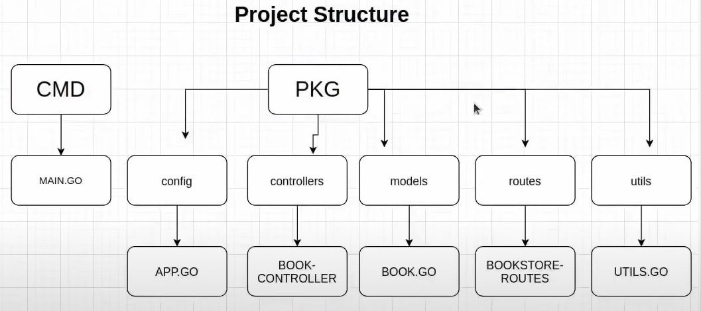
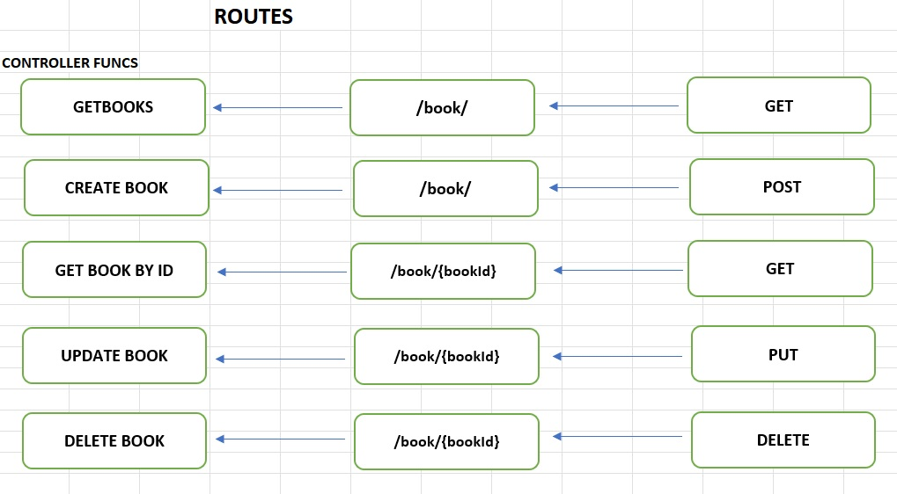

# Bookstore Management System

This project has the folowing characteristcs:

1. It's composed by Database - Mysql;
2. The GORM package to interact with the database;
3. We also are using JSON marshall and unmarshall;
4. All project is separate in a structure of folders;
5. We also are using the package Gorilla Mux for our routes.

## **Project Struture**



We have two main folders, **cmd** and **pkg**, in the **cmd** folder we only have the **main.go** file, and in the **pkg** folder we will have the **config**, **controllers**, **models**,**routes** and **utils** folders.

- **config**: We have **app.go** file, wich help us to conect with our database.
- **controllers**: We have **book-controller.go** file, wich have the functions that help us process the data that we'll get for as response, and also the request that we'll get from the user and the response that we need send.
- **models**: We have **book.go** file, wich help us to create those structs and models that will be used by our database.
- **routes**: We just have **bookstore-routes.go** file, with our routes that will see later.
- **utils**: we just have the code for marshalling and unmarshalling JSON from our respose and our request.



## **How to start?**

First is necessary connecting with the database. Will be necessary create our **simplerest** database.
I recommend using docker to run MySQL:
`docker run --name mysql-container -p 9010:3306 -v CAMINHO_DO_DIRETORIO_LOCAL:/var/lib/mysql -e MYSQL_ROOT_PASSWORD=test123 -d mysql:latest`

**Explanation:**

- `--name mysql-container`: sets the name of the container as "mysql-container"
- `-p HOST_PORT:3306`: maps the specified host port to port 3306 inside the container (MySQL's default port)
- `-v LOCAL_DIRECTORY_PATH:/var/lib/mysql`: mounts the specified local directory to the /var/lib/mysql directory inside the container (where MySQL stores its data)
- `-e MYSQL_ROOT_PASSWORD=test123`: sets our root password for the MySQL instance
- `-d mysql:latest:` uses the latest official MySQL image and runs the container in "detached" mode
  Remember to replace the generic value _"CAMINHO_DO_DIRETORIO_LOCAL"_ with your specific path.

After this we can run our app:
`go run main.go`

With that, our app already starts on port 9010, and we can use Postman to do our tests.

## **How to insert data in Postman?**

In the postman we need create each one of our routes, and then we can create our first book with the command:

```
{
    "Name":"Epistle to the Romans",
    "Author":"Paul the Apostle",
    "Publication": "Year 55"
}
```

It will have the same shape as we did in our struct. Remember to configure as a raw mode and in JSON.
